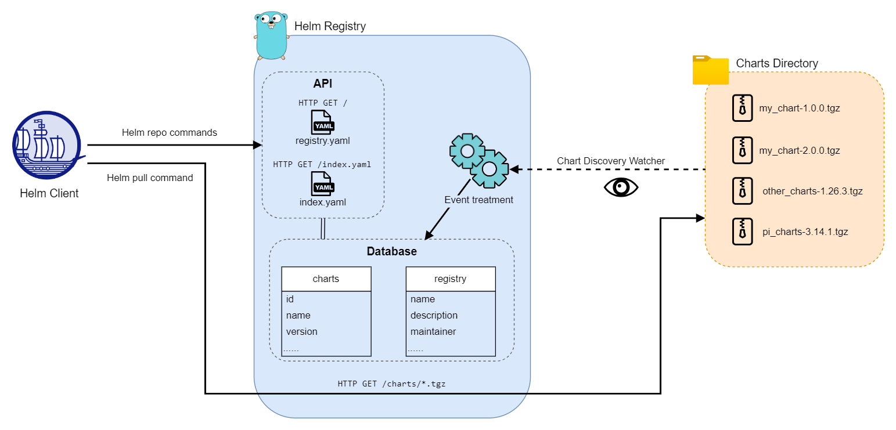

# Helm registry
A simple Helm registry for store and share Helm package
\

This project is for have a simple [Helm registry](https://helm.sh/docs/topics/chart_repository/) and a web admin UI for manage registry.
There are 2 parts :
- **Backend** : Build in Go, API for store Helm package
- **Frontend** : Build in ReactJS, for Web UI to manage Helm registry

These parts are Docker images, that you use and deploy him in Docker env.

## Features :sparkles:
- expose `index.yaml` file and `/charts/*.tgz` charts, according to the [Helm registry requirement](https://helm.sh/docs/topics/chart_repository/)
- **Chart Discovery** : Automatically insert/update/delete charts from the charts directory, in database and update the `index.yaml` file.
- **Chart Discovery** : Browse all `.tgz` files and open them to search file `Chart.yaml` inside, extract chart information and send this to the Database and updating `index.yaml` file.
- Customize the home page of the registry (`/`) with a CRD (`helm`) to describe your registry.

### Environment 
- [x]  On **Windows**
- [x] On **Linux**
- [x] On **Docker**, use the Docker image to deploy this registry on Docker env. You can use a Docker Compose file to deploy this (an [exemple here](docker-compose.yaml))

### Helm commands coverage

The Helm client-side commands that you can use with this registry. Doc [here](https://helm.sh/docs/helm/helm_repo/)
- [x]  **helm repo add** :  Able to add the registry in your Helm client
- [x] **helm repo update** : Update your client copy of your distant registry to be able to pull chart
- [x] **helm search repo** : Able to list all charts available in your registry
- [x] **helm pull** : Able to pull a chart from your registry to use it 
- [ ] **helm push** : Currently unable to push a chart into this registry (maybe in newer version)
- [ ] **credentials flags** (--pass-credentials, --password, --password-stdin and --username) : Currently any credential is required to use the registry (_in coming in newer version_)

## Get stated :rocket:

### Install from source code

### Install on Linux

### Install on Windows

### Install on Docker

### Environment Variables
It exists some environment variables to customize the registry.

| Variable                  | Description                                                                                                                                   |
|:--------------------------|:----------------------------------------------------------------------------------------------------------------------------------------------|
| `REGISTRY_NAME`           | Name of the registry                                                                                                                          |
| `REGISTRY_DESCRIPTION`    | A description of the registry                                                                                                                 |
| `REGISTRY_VERSION`        | Version of the registry                                                                                                                       |
| `REGISTRY_MAINTAINER`     | Name of the registry maintainer. Can be a person or an organisation                                                                           |
| `REGISTRY_MAINTAINER_URL` | URL of the website or email address of the registry maintainer                                                                                |
| `REGISTRY_LABELS`         | List (separated by ';') of labels. E.g : `env:prod;project:test`                                                                              |
| `CHARTS_DIR`              | Path of charts directory location. By default : for Linux `/usr/helm-registry/charts`, Windows `%USERPROFILE%\Documents\helm-registry\charts` |

## Version
 
- [v1] First API version with basic actions for a simple usage. According to the Helm repository requirements

## Contributors 👪

- :crown: [Benjamin Fourmaux](https://github.com/BenjaminFourmaux)

## Licence ⚖️
All files on this project is under [**Apache License v2**](https://www.apache.org/licenses/LICENSE-2.0).
You can:
- Reuse the code 
- Modified the code
- Build the code

You must **Mention** the © Copyright if you use and modified code for your own profit. Thank you

© 2024 - Benjamin Fourmaux -- Beruet - All right reserved
